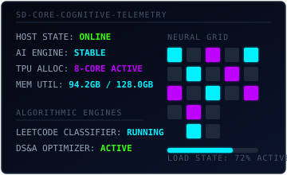

<p align="center">
  <!-- Flagship Premium Capsule Render Header -->
  
</p>

<p align="center">
  <!-- Custom Self-Animating Terminal Simulator -->
  
</p>

<p align="center">
  <!-- Glowing Data Bus Divider -->
  
</p>

---

## 🛰️ IDENTITY NODE & CORE TELEMETRY

<table border="0" cellpadding="0" cellspacing="0" width="100%" style="border-collapse: collapse; border: none; background: transparent;">
  <tr style="border: none; background: transparent;">
    <!-- Profile Text Console -->
    <td width="55%" valign="top" style="border: none; padding-right: 20px;">
      <h3><code>// CORE_SYSTEM_USER_SPECS</code></h3>
      <p>I am a computer science engineering student specializing in <strong>Artificial Intelligence &amp; Machine Learning</strong>, focused on bridging rigorous algorithmic problem-solving with scalable neural architectures.</p>
      <ul>
        <li>🏫 <strong>Institution:</strong> Institute of Engineering &amp; Management (IEM), Kolkata</li>
        <li>🎓 <strong>Degree Track:</strong> B.Tech in CSE (AI &amp; ML)</li>
        <li>🎯 <strong>Active Priority:</strong> Designing production-ready models and mastering core Data Structures &amp; Algorithms</li>
        <li>🧬 <strong>Creative Outlet:</strong> Tech product development, startups, and urban photography</li>
      </ul>
      <p><em>Looking at systems through a multi-dimensional lens—where mathematical algorithms meet futuristic product design. Inspired by the Tokyo Cyberpunk visual language and neural pathways.</em></p>
    </td>
    <!-- Pulse Systems Grid SVG Widget -->
    <td width="45%" valign="middle" align="center" style="border: none;">
      
    </td>
  </tr>
</table>

<p align="center">
  
</p>

---

## ⚡ MISSION CONTROL: ACTIVE PRIORITIES

> [!NOTE]
> The missions below represent my high-focus architectural tracks. Progress indicators are updated relative to core projects and optimization cycles.

<table border="0" cellpadding="10" cellspacing="0" width="100%" style="border-collapse: collapse; border: 1px solid #1E293B; border-radius: 6px; background-color: #050811;">
  <thead>
    <tr style="background-color: #0B132B; border-bottom: 1px solid #1E293B;">
      <th align="left" style="padding: 10px; font-family: monospace; font-size: 12px; color: #00F0FF;">ACTIVE OPERATION</th>
      <th align="left" style="padding: 10px; font-family: monospace; font-size: 12px; color: #BD00FF;">OBJECTIVE TARGET</th>
      <th align="right" style="padding: 10px; font-family: monospace; font-size: 12px; color: #39FF14;">COMPILATION</th>
    </tr>
  </thead>
  <tbody>
    <tr style="border-bottom: 1px solid #1E293B;">
      <td style="padding: 12px; font-family: monospace; font-size: 13px; color: #E2E8F0;"><strong>Op. Algorithmic Synthesis</strong></td>
      <td style="padding: 12px; font-family: sans-serif; font-size: 13px; color: #94A3B8;">Mastering advanced Data Structures &amp; Algorithms on LeetCode to build hyper-efficient solution engines.</td>
      <td align="right" style="padding: 12px; font-family: monospace; font-size: 13px; color: #00F0FF;"><code>[██████████████░░░░░░] 70%</code></td>
    </tr>
    <tr>
      <td style="padding: 12px; font-family: monospace; font-size: 13px; color: #E2E8F0;"><strong>Op. End-to-End Product</strong></td>
      <td style="padding: 12px; font-family: sans-serif; font-size: 13px; color: #94A3B8;">Constructing scalable AI pipelines with full-stack interfaces, containerized structures, and robust backends.</td>
      <td align="right" style="padding: 12px; font-family: monospace; font-size: 13px; color: #BD00FF;"><code>[████████░░░░░░░░░░░░] 40%</code></td>
    </tr>
  </tbody>
</table>

<br />

<p align="center">
  
</p>

---

## 🧠 TECH TELEMETRY MATRIX

> [!IMPORTANT]
> To maintain developer credibility, systems are categorized strictly by execution capability. Mastered technologies compile under `ONLINE`, whereas emerging modules reside under `TRAINING` and `PLANNED`.

```
  ┌────────────────────────────────────────────────────────────────────────┐
  │ 🟢 ONLINE (Compiled & Operational)                                     │
  │    ├─ Languages: C ── Java ── Python                                   │
  │    └─ Core: Data Structures & Algorithms ── Algorithmic Problem Solving│
  ├────────────────────────────────────────────────────────────────────────┤
  │ 🔵 TRAINING (Active Learning & Integration)                             │
  │    ├─ Intelligence: Machine Learning ── Deep Learning ── Generative AI │
  │    └─ Interfaces: React ── Databases (SQL/NoSQL)                       │
  ├────────────────────────────────────────────────────────────────────────┤
  │ 🟡 PLANNED (Future Architectural Upgrades)                             │
  │    └─ Architecture: Docker ── Backend Development ── System Design     │
  └────────────────────────────────────────────────────────────────────────┘
```

<p align="center">
  
</p>

---

## 🗃️ REPOSITORY SHOWCASE COMMAND DECK

<table border="0" cellpadding="0" cellspacing="0" width="100%" style="border-collapse: collapse; border: none; background: transparent;">
  <!-- Row 1 -->
  <tr style="border: none; background: transparent;">
    <!-- Card 1: Algorithmic Engines -->
    <td width="50%" valign="top" style="border: none; padding: 10px;">
      <table width="100%" style="border: 1px solid #1E293B; border-radius: 6px; background-color: #050811; border-collapse: collapse;">
        <tr style="background-color: #0B132B;"><td style="padding: 8px; font-family: monospace; font-size: 12px; color: #00F0FF; border-bottom: 1px solid #1E293B;"><strong>[ VECTOR_01 // ALGORITHMS ]</strong></td></tr>
        <tr>
          <td style="padding: 12px; font-family: sans-serif; font-size: 13px; color: #94A3B8;">
            <h4 style="margin: 0 0 8px 0; color: #F8FAFC;">LeetCode Algorithmic Engines</h4>
            Optimized, clean implementations of core and advanced data structures and algorithms in Python, Java, and C. Focuses on low execution time and minimal memory footprints.
            <br /><br />
            <code>Status: Active</code> | <code>Efficiency: O(log N) target</code>
          </td>
        </tr>
      </table>
    </td>
    <!-- Card 2: ML Pipelines -->
    <td width="50%" valign="top" style="border: none; padding: 10px;">
      <table width="100%" style="border: 1px solid #1E293B; border-radius: 6px; background-color: #050811; border-collapse: collapse;">
        <tr style="background-color: #0B132B;"><td style="padding: 8px; font-family: monospace; font-size: 12px; color: #BD00FF; border-bottom: 1px solid #1E293B;"><strong>[ VECTOR_02 // MACHINE_LEARNING ]</strong></td></tr>
        <tr>
          <td style="padding: 12px; font-family: sans-serif; font-size: 13px; color: #94A3B8;">
            <h4 style="margin: 0 0 8px 0; color: #F8FAFC;">Data Processing &amp; Neural Pipelines</h4>
            End-to-end model building pipelines, incorporating feature engineering, training scripts, hyperparameter optimization, and statistical predictive modeling.
            <br /><br />
            <code>Status: Compiled</code> | <code>Engines: PyTorch / Scikit-Learn</code>
          </td>
        </tr>
      </table>
    </td>
  </tr>
  <!-- Row 2 -->
  <tr style="border: none; background: transparent;">
    <!-- Card 3: AI Projects -->
    <td width="50%" valign="top" style="border: none; padding: 10px;">
      <table width="100%" style="border: 1px solid #1E293B; border-radius: 6px; background-color: #050811; border-collapse: collapse;">
        <tr style="background-color: #0B132B;"><td style="padding: 8px; font-family: monospace; font-size: 12px; color: #39FF14; border-bottom: 1px solid #1E293B;"><strong>[ VECTOR_03 // INTELLIGENCE ]</strong></td></tr>
        <tr>
          <td style="padding: 12px; font-family: sans-serif; font-size: 13px; color: #94A3B8;">
            <h4 style="margin: 0 0 8px 0; color: #F8FAFC;">Generative Agentic Platforms</h4>
            Exploratory architectures utilizing Large Language Models, customized agents, vector embeddings, and retrieval-augmented generation systems.
            <br /><br />
            <code>Status: In Training</code> | <code>Pipelines: RAG / Custom Agents</code>
          </td>
        </tr>
      </table>
    </td>
    <!-- Card 4: Future Research -->
    <td width="50%" valign="top" style="border: none; padding: 10px;">
      <table width="100%" style="border: 1px solid #1E293B; border-radius: 6px; background-color: #050811; border-collapse: collapse;">
        <tr style="background-color: #0B132B;"><td style="padding: 8px; font-family: monospace; font-size: 12px; color: #94A3B8; border-bottom: 1px solid #1E293B;"><strong>[ VECTOR_04 // RESEARCH ]</strong></td></tr>
        <tr>
          <td style="padding: 12px; font-family: sans-serif; font-size: 13px; color: #94A3B8;">
            <h4 style="margin: 0 0 8px 0; color: #F8FAFC;">Systems &amp; Architecture Lab</h4>
            Exploratory repository showcasing modular software designs, container orchestration setups, and backend system frameworks designed for high availability.
            <br /><br />
            <code>Status: Planned</code> | <code>Target: System Design Architecture</code>
          </td>
        </tr>
      </table>
    </td>
  </tr>
</table>

<p align="center">
  
</p>

---

## 📈 SYSTEM ANALYTICS & REPOSITORY STATS

<table border="0" cellpadding="0" cellspacing="0" width="100%" style="border-collapse: collapse; border: none; background: transparent;">
  <tr style="border: none; background: transparent;">
    <!-- Column 1: Custom Themed GitHub Stats -->
    <td width="50%" align="center" valign="top" style="border: none; padding: 10px;">
      
    </td>
    <!-- Column 2: Custom Themed Streak Stats -->
    <td width="50%" align="center" valign="top" style="border: none; padding: 10px;">
      
    </td>
  </tr>
  <tr style="border: none; background: transparent;">
    <!-- Top Languages -->
    <td colspan="2" align="center" valign="top" style="border: none; padding: 10px;">
      
    </td>
  </tr>
</table>

<p align="center">
  
</p>

---

## 🧬 NEURAL SYNAPTIC CONTRIBUTION GRAPH

<p align="center">
  <!-- Isometric 3D Graph (dynamically updated on output branch) -->
  
</p>

<p align="center">
  <!-- Custom Cyberpunk contribution snake -->
  
</p>

<p align="center">
  
</p>

---

## 📥 SECURE CONNECTION SUBSYSTEM

```bash
guest@sattwik-18:~$ connect --secure --active-channels
```

<table border="0" cellpadding="10" cellspacing="0" width="100%" style="border-collapse: collapse; border: 1px solid #1E293B; border-radius: 6px; background-color: #050811;">
  <thead>
    <tr style="background-color: #0B132B; border-bottom: 1px solid #1E293B;">
      <th align="left" style="padding: 10px; font-family: monospace; font-size: 12px; color: #00F0FF;">CONNECTION CHANNEL</th>
      <th align="left" style="padding: 10px; font-family: monospace; font-size: 12px; color: #BD00FF;">DESTINATION ROUTE</th>
      <th align="right" style="padding: 10px; font-family: monospace; font-size: 12px; color: #39FF14;">ACCESS STATUS</th>
    </tr>
  </thead>
  <tbody>
    <tr style="border-bottom: 1px solid #1E293B;">
      <td style="padding: 12px; font-family: monospace; font-size: 13px; color: #E2E8F0;">💼 <strong>LinkedIn</strong></td>
      <td style="padding: 12px; font-family: sans-serif; font-size: 13px; color: #94A3B8;"><a href="https://linkedin.com/in/sattwik-datta" target="_blank" style="color: #00F0FF; text-decoration: none;">linkedin.com/in/sattwik-datta</a></td>
      <td align="right" style="padding: 12px; font-family: monospace; font-size: 13px; color: #39FF14;"><code>[ESTABLISHED]</code></td>
    </tr>
    <tr>
      <td style="padding: 12px; font-family: monospace; font-size: 13px; color: #E2E8F0;">📧 <strong>Email Portal</strong></td>
      <td style="padding: 12px; font-family: sans-serif; font-size: 13px; color: #94A3B8;"><a href="mailto:sattwikdatta2@gmail.com" style="color: #BD00FF; text-decoration: none;">sattwikdatta2@gmail.com</a></td>
      <td align="right" style="padding: 12px; font-family: monospace; font-size: 13px; color: #39FF14;"><code>[LISTENING]</code></td>
    </tr>
  </tbody>
</table>

<br />

<p align="center">
  
</p>
